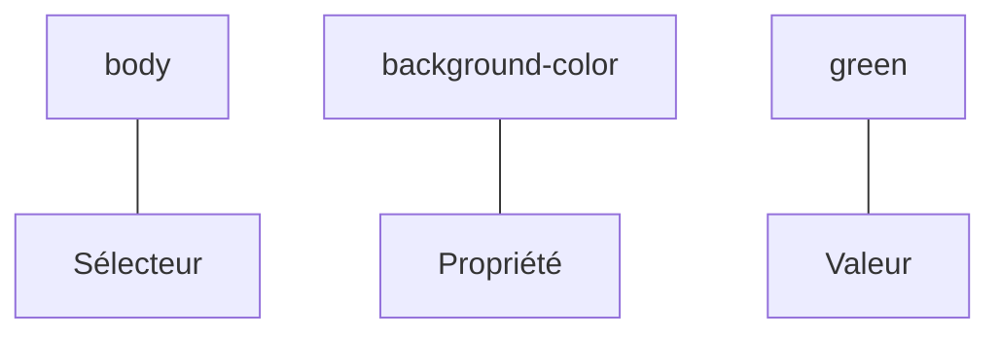

# Apprendre les Fondamentaux du Web avec un projet guidé de A à Z
## Le language CSS

Alors, c'est bien curieux ! Mais voilà, ils ont créé le langage **CSS**. Qui permet de créer des feuilles de styles qu'on peut appliquer à notre squelette HTML afin de lui donner vie, de la forme, et des couleurs.

Il s'agit du **World Wide Web Consortium** (W3C) qui a la responsabilité de tout ce qui est spécification Web.

Le langage CSS nous permet donc de donner des styles à notre contenu HTML.

Nous allons y aller petit à petit pour découvrir les styles fondamentales. Mais avant, il est important de pouvoir:

* Lier deux fichiers HTML et CSS.
* Comprendre les sélecteurs.

### Liaison des fichiers
Dans notre HTML, on peut indiquer quels fichier de style s'appliquent à notre page.

Pour cela, on utilise la balise `link` placée dans l'élément `head` de la page.

```diff
    <!doctype>
    <html>
        <head>
            <title>Le langage CSS</title>
            <meta charset="utf-8">
            <meta name="viewport" content="width=device-width, initial-scale=1.0">
+           <link rel="stylesheet" href="styles.css" >
        </head>
        <body>
            <h1>Apprenons les styles en CSS</h1>
        </body>
    </html>
```

Enregistrons le contenu et puis finalement, dans le même dossier que notre fichier HTML, on crée un fichier `styles.css`.

### Notions de sélecteurs
Maintenant que nous pensons que les fichiers HTML et CSS sont reliés, vérifions en appliquant notre premier style.

Dans le fichier CSS, on ajoute ce bout de code:

```css
body {
    background-color: green;
}
```

Enregistrons le fichier CSS et puis on va ouvrir le fichier HTML dans le navigateur.

Si tout est bien fait, on devrait avoir une nouvelle couleur à l'arrière plan: le **vert**.

Voilà, on vient comme ça d'écrire notre premier code CSS.

> **Note :** Il est inutile d'ouvrir le fichier CSS dans le navigateur. Nous avons créé le fichier HTML et nous avons ajouté une ligne pour le relier au code CSS. Du coup, il va importer les styles qui sont dans le fichier CSS pour se les appliquer.

Expliquons brièvement le code qu'on a écrit tout de suite.

En CSS, on a les sélecteurs, les propriétés et les valeurs; c'est tout !



On va s'intéresser aux sélecteurs, il en existe plusieurs, mais on verra quelques uns seulement.

* Sélecteurs d'éléments comme `body`, `p`, `div`, `ul`, etc. On prend juste le nom de l'élement que l'on cible. Les propriétés seront appliqués à tous les éléments de la page qui sont de même type. Par exemple
    ```css
    p{
        color: red;
    }
    ```
    va colorier tous les paragraphes du document en rouge.

* Les sélecteurs de classe.
    En HTML? on peut créer des éléments en leur ajoutant un attribut `class`.
    ```html
        <body>
            <h1>Les sélécteurs</h1>
            <p class="highlight">Lorem ipsum</p>
            <p>Dolor sit</p>
            <p class="highlight">Amet consectetur</p>
        </body>
    ```

    Grâce à cet attribut, on pourra les cibler en CSS, comme suit:
    ```css
    .highlight {
        color: red;
        font-weight: 700;
    }
    ```

    Voilà !

    On peut même :
    ```css
    p.highlight {
        color: red;
        font-weight: 700;
    }
    ```
    pour dire qu'on ne s'intéresse qu'aux paragraphes qui ont la classe `highlight`

    &nbsp;

    > **Note:** Remarquez que la classe est collée au nom de l'élément.

    Si on veut styliser le paragraphe qui n'a pas la classe `highlight`, cibler juste avec `p` ne sera pas suffisant.

    Pour ce faire, on peut:
    
    ```css
    p:not(.highlight) {
        color: red;
        font-weight: 700;
    }
    ```

* Les sélecteurs d'identifiant !    
    Si on ajoute un attribut `id` à notre élément, alors on peut le cibler en CSS avec `#<nom-identifiant>`.

    Par exemple:

    ```html
    <body>
        <h1>Les sélécteurs</h1>
        <p>Dolor sit</p>
        <p id="second">Amet consectetur</p>
    </body>
    ```

    ```css
    #second {
        color: red;
        font-weight: 700;
    }
    ```

    > **Note :** Un identifiant est unique par page HTML.

Et ainsi de suite, il y en a plein d'autres sélecteurs comme :

* Sélecteur universel : 
    ```css
    /* Pour cibler les éléments de la page, quels qu'ils soient */
    * {
        margin: 0;
    }
    ```

* Sélecteur de descendants: 
    ```css
    /* Pour cibler toutes les cellules d'un tableau */
    table td {
        border: 1px solid black;
    }
    ```

* Sélecteurs d'enfants directs:

    ```css
    /* Pour cibler tous les paragraphes qui sont des enfants directs d'une div */
    div > p {
        text-align: center;
    }
    ```

* Sélecteurs de voisins
    ```css
    /* Pour cibler tous les paragraphes qui sont positionnés après des h2 */
    h2 + p {
        margin-top: 50px;
        border-top: 2px dashed gray;
    }
    ```

> **Note :** On peut grouper les sélecteurs en les séparant par une virgule.

### Valeurs spéciales
En CSS, il serait intéressant qu'on révise un peu quelques valeurs intéressantes:

* Les mesures
* Les couleurs

#### Les mesures
Pour le cas des **mesures**, nous avons plusieurs unités telles que:
1. Les unités statiques
    - **pixel** (`px`)
    - **centimètre** (`cm`)
    - **inch** (`in`)
2. Les unités relatives
    - **pourcentage** (`%`)
    - **em** (relatif à la taille de police de l'élement parent.)
    - **rem** (relatif à la taille de police de l'élement `:root` ou `body`)
    - **vh** (relatif à hauteur du viewport)
    - **vw** (relatif à la largeur du viewport)

Cependant pour le cadre de ce cours, on se contentera de trois unités: `px`, `rem` et `em`.

#### Les couleurs
Pour ce qui est des couleurs, il existe plusieurs façon de les exprimer également.

> Basiquement, on peut obtenir n'importe quelle couleur en additionnant des couleurs fondamentales : `rouge`, `bleu` et `vert`.

On va retenir trois façons pour donner une couleur (mais il en existe d'autres.)

* A partir de son nom
    Oui, des nom comme `blue`, `black`, `white`, `red`, `yellow`, `green`, `teal`, `purple`, `gray`, `turquoise`, `pink`, `violet`, etc. Une liste non exhaustive se trouve sur [cette page](https://www.w3schools.com/cssref/css_colors.php).
* A partir de son **code rgb**
    Pour le code **RGB**, il suffit de connaitre les variation de `rouge`, `bleu` et `vert` de la couleur pour obtenir la couleur que l'on veut. La quantité minimale pour chaque variation est **0** tandis que la quantité maximale est **255**.

    On va prendre quelques exemples

    |Couleur|Code RGB|
    |-|-|
    |Noir|`rgb(0, 0, 0)`|
    |Blanc|`rgb(255, 255, 255)`|
    |Bleu|`rgb(0, 0, 255)`|
    |Rouge|`rgb(255, 0, 0)`|
    |Vert|`rgb(0, 255, 0)`|
    |Jaune|`rgb(255, 255, 0)`|

* A partir de son **code hexadécimal**
    Finalement, il suffit de prendre la correspondance hexadécimale de chaque quantité du code **RGB** pour former une couleur en mode hexa. On va reprendre le tableau précédent.

    |Couleur|Code Hexa|
    |-|-|
    |Noir|`#000000`|
    |Blanc|`#FFFFFF`|
    |Bleu|`#0000FF`|
    |Rouge|`#FF0000`|
    |Vert|`#00FF00`|
    |Jaune|`#FFFF00`|

    
    > Note: Pour les valeurs **hexa**, naturellement, la quantité minimale est **00** tandis que la quantité maximale est **FF**.


### Texte mielleux
Après cet apparté sur les sélecteurs, les valeurs particulières, nous allons nous intéresser à comment on va enrichir notre texte. Pour cela, nous aborderons nombre de propriétés ayant trait au texte.

|Propriété|Description|
|-|-|
|`font-family`|Pour changer la police d'écriture|
|`font-weight`|Pour mettre le poids de la police (gras)|
|`font-size`|Modifier la taille de police|
|`text-align`|Changer l'allignement du texte|
|`text-decoration`|Pour le |
|`text-transform`|Changer la casse|
|`color`|Pourla couleur de texte|
### Système de boites
En HTML, tout est une boite. Mais on classe les éléments en deux: **inline** et **block**.

> **Inline:** Ceux qui s'insèrent au flux et ne cause pas de décalage en occupant toute la largeur de l'écran.

> **Block:** Ceux qui s'insèrent au flux et causent un décalage en occupant toute la largeur qu'on leur attribue.

Et y a certaines propriétés assez intéressantes pour les boîtes:

* Les bordures (`border`)
* Les marges internes (`padding`)
* Les marges externes (`margin`)

### Et c'est bouclé !
Il y a assez de styles à explorer à découvrir. Mais, une fois à ce stade, on va attaquer le code de base de notre projet de formation.