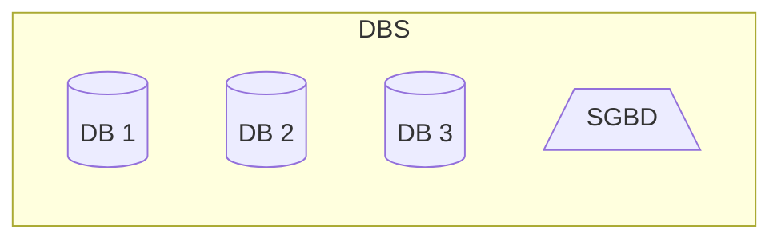
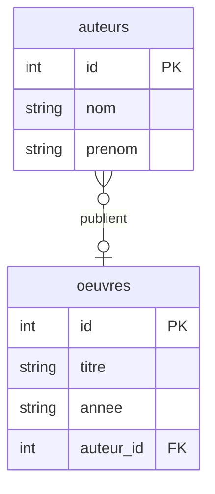
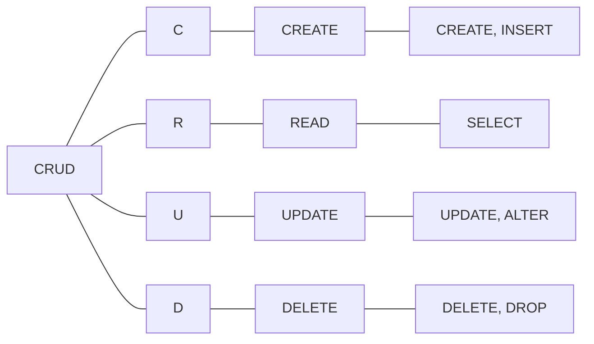

# Apprendre les Fondamentaux du Web avec un projet guidé de A à Z
## Notions de base en MySQL

MYSQL  est l'un des SGBD (Système de Gestion de Base de Données Relationnelles) les plus populaires de nos jours.


On utilise les SGBD pour gérer la base de données. Parmi les tâches nous avons la structuration des données grâce à un modèle. Aussi de contrôler les accès à la base de données, l'intégrité, la sécurité.

On appelle base de données un ensemble structuré d'informations relatives à un contenu.

Un SGBD peut gérer plusieurs bases de données en même temps.

Observez le graphique suivant.



On parle de base de données relationnelles.

Observons ces tableaux suivants listant les auteurs et leurs oeuvres

* Auteurs
    |id|prenom|nom|
    |-|-|-|
    |1|Alexandre Biyidi|Awala|
    |2|Ousmane|Sembène|
    |3|Abdoulaye|Sadji|

* Oeuvres
    |id|titre|annee|auteur_id|
    |-|-|-|-|
    |1|Le Pauvre Christ de Bomba|1956|1|
    |2|Perpétue et l'habitude du malheur|1974|1|
    |3|Les bouts de bois de Dieu|1960|2|
    |4|Maïmouna|1953|3|
    |5|Nini, mulâtresse du Sénégal|1954|3|


Dans les bases données, les informations sont organisées en **tables** litteralement des tabeaux avec des lignes et des colonnes.

Les lignes sont appellées **enregistrements**.
Les colonnes sont appelées **champs** ou **attributs**.

Dans les deux tableaux *oeuvres* et *auteurs*, nous avons des informations bien établies. Mais en plus, on remarque des chiffres. Ces derniers nous permettent:

1. D'identifier chaque information de la base de données de façon unique : on parle de **clé primaire**.
2. D'établir la liaison des informations éparpiées dans plusieurs tables: on parle de **clé étrangère**.

---

## Outils

Pour pouvoir utiliser MySQL, nous avons dores et déjà installé [EasyPHP](https://www.easyphp.org/download.php), un outil simple parmi tant d'autres qui permet d'installer un serveur Web et un serveur de base de données ainsi que des outils d'administration.

Nous allons lancer le serveur et nous y connecter. Pour cela, nous allons modifier un peu les variables d'environnement système pour ajouter le chemin de l'exécutable `mysql`.

Sur la console, il suffit de se connecter à MySQL à travers la commande:

```bash
mysql -u root -p
```

Par défaut, il n'y a pas de mot de passe, il suffit d'appuyer sur la touche entrée.

Une fois connecté, nous allons désormais faire des requêtes.

> Une requête est une instruction ou une demande lancée au serveur en vue d'obtenir une réponse.

* Lister les bases de données
    ```sql
    SHOW DATABASES;
    ```

* Créer une base de données
    ```sql
    CREATE DATABASE library CHARACTER SET UTF8MB4;
    ```

* Sélectionner une base données
    ```sql
    USE library;
    ```

* Lister les tables à l'intérieur
    ```sql
    SHOW TABLES;
    ```

Intéressons-nous à ce modèle E/R pour la bibliothème où on va supposer qu'un bouquin a un auteur et un même auteur peut publier plusieurs oeuvres.



Comme on a appris, en modèle logique, pour pouvoir garder trace de celui qui a publié l'oeuvre, la clé de l'auteur va intégrer la table oeuvres.

Bon, pour finir on va mettre les scripts pour créer ces deux tables et les associer par une relation.

* Créer la table `oeuvres`
    ```sql
    CREATE TABLE oeuvres(
        id INT AUTO_INCREMENT PRIMARY KEY,
        titre VARCHAR(100) NOT NULL,
        annee VARCHAR(4),
        auteur_id INT
    )engine=InnoDB;
    ```

* Créer la table `auteurs`
    ```sql
    CREATE TABLE auteurs(
        id INT AUTO_INCREMENT PRIMARY KEY,
        nom VARCHAR(20) NOT NULL,
        prenom VARCHAR(30) NOT NULL
    )engine=InnoDB;
    ```

* Relier les deux tables
    ```sql
    ALTER TABLE oeuvres
    ADD CONSTRAINT FOREIGN KEY(auteur_id)
    REFERENCES auteurs(id)
    ON DELETE SET NULL;
    ```


A ce stade, on peut vérifier nos changements:

```sql
SHOW TABLES;
DESCRIBE oeuvres;
DESC auteurs;

SHOW CREATE TABLE oeuvres;
SHOW CREATE TABLE auteurs;
```

Nous pouvons aussi le vérifier directement sur l'espace d'administration phpMyAdmin


Nous allons explorer plus en détails ce qu'on peut faire.

## CRUD

Le CRUD est un acronyme signifiant `CREATE`, `READ`, `UPDATE`, `DELETE`. Le diagraphe mermaid suivant explique cela d'avantage.



Nous allons donc nous amuser à twick avec la base de données qu'on a créée jusqu'ici.

* Ajouter des données dans les tables (CREATE):

    ```sql
    INSERT INTO auteurs (id, nom, prenom) 
    VALUES (1, "Alexandre Biyidi", "Awala");

    INSERT INTO auteurs (id, nom, prenom) 
    VALUES (2, "Ousmane", "Sembène");

    
    INSERT INTO auteurs (id, nom, prenom) 
    VALUES (3, "Abdoulaye", "Sadji");
    ```

    De cette façon nous avons nos trois auteurs...

* Vérifions l'ajout en listant les informations qui se trouvent sur la table (READ)

    ```sql
    SELECT * FROM auteurs;
    ```

* On peut aussi s'amuser à ajouter d'autres auteurs hein 😋😋😋 !

    ```sql
    INSERT INTO auteurs (nom, prenom) 
    VALUES 
    ("", ""),
    ("", ""),
    ("", ""),
    ("", "");
    ```

    > **Note:** Vous devez remplacez les chaines vides par les noms et prenoms ... 

    ça devient intéressant si en effet on peut ajouter plusieurs à la suite !


* Qui a dit qu'il n'y avait que les auteurs ? il ont écrit non ?

    ```sql
    INSERT INTO oeuvres (id, titre, annee, auteur_id)
    VALUES (1, "Le Pauvre Christ de Bomba", 1956,1);

    INSERT INTO oeuvres (id, titre, annee, auteur_id)
    VALUES (2, "Perpétue et l'habitude du malheur", 1974, 1);

    INSERT INTO oeuvres (id, titre, annee, auteur_id)
    VALUES (3, "Les bouts de bois de Dieu", 1960, 2);

    INSERT INTO oeuvres (id, titre, annee, auteur_id)
    VALUES (4, "Maïmouna", 1953, 3);

    INSERT INTO oeuvres (id, titre, annee, auteur_id)
    VALUES (5, "Nini, mulâtresse du Sénégal", 1954, 3);
    ```


Bref, maintenant qu'on a des informations, on va faire des request assez interessantes !

* Afficher les livres
    ```sql
    SELECT * FROM oeuvres;
    ```

* Mais on peut aussi ajouter des livres non ???
    ```sql
    INSERT INTO oeuvres (titre, annee, auteur_id) 
    VALUES 
    ("", "", 0),
    ("", "", 0),
    ("", "", 0),
    ("", "", 0),
    ("", "", 0),
    ("", "", 0);
    ```

    > **Note:** Remplacez les valeur par les bonnes !

On va maintenant voir comment répondre aux questions suivantes:

* Les livres de Aboudlaye Sadji
* Les livres qui n'ont pas d'auteurs
* Les livres qui sont publiés après 1960
* Les livres qui sont publiés en 1960
* L'auteur de ce livre
* Les auteurs qui ont des bouquins dans la DB
* Les auteurs qui n'ont pas de bouquins dans la DB
* Le plus vieux bouquin enregistré
* L'auteur du plus vieux bouquin enregistré


On peut vraiment utiliser les requêtes pour récupérer des informations plus complexes

* Le nombre de livres
* Le nombres d'auteurs
* Le nombre de bouquins dans la DB pour chaque auteur

Fini les SELECT

On va update !
Delete !
Puis drop !

> Une fois à ce stade, on va s'interesser à notre projet pour créer sa base de données.