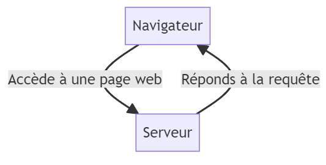

# Apprendre les Fondamentaux du Web avec un projet guidé de A à Z
## Notions de base en PHP

PHP est un langage de programmation qui permet de créer des pages web dynamiques.

On dit que le langage est un langage orienté serveur backend. Parce que grâce à lui on génère des pages web qui peuvent être retournées au client HTTP.

De base, avec le dossier `ISTDiplome` qui contient des fichiers **HTML** et **CSS** et qui décrit l'architecture générale le notre application nous pouvons tout naturellement l'héberger sur un serveur local **Apache** qui permet de traduire les pages **PHP**. Mais vu que ce sont des fichiers HTML qu'on a, on dira que notre site pour l'instant est **statique**.

A travers ce didacticiel, nous allons explorer toutes les étapes qu'il faut pour bien réussir à rendre le projet **dynamique** en vue de télécharger le diplôme de n'importe qui qui se trouve dans la base de données.

Tout d'abord, nous avons donné une brève définition au langage PHP, on va y revenir encore:

> **PHP** est un langage de programmation orienté serveur qui permet de rendre des sites web dynamiques.

## Setup
Grâce à l'installation qu'on a faite de EasyPHP, nous avons installé non seulement un serveur de bases de données `MySQL`(qu'on avait exploré hier) mais aussi un serveur HTTP: `Apache` pouvant interpréter les codes PHP.


L'accès au dashboard nous permettrait de pouvoir configurer des virtual hosts mais vu que cela n'a pas marché pour la plupart, nous allons juste copier coller le dossier de notre projet `ISTDiplome` dans le dossier `eds-www` d'EasyPHP. Grâce à cela, nous pourrons y accéder simplement à travers l'une de ces addresses suivantes:

* http://localhost:8080/ISTDiplome
* http://127.0.0.1:8080/ISTDiplome
* http://localhost/ISTDiplome
* http://127.0.0.1:8080/ISTDiplome

> La page par défaut qui sera chargée est `index.html`.


Le premier setup qu'on va faire sera de changer l'extention de tous nos fichiers en `.php` en lieu et place de `.html`. En effet, un fichier PHP doit avoir l'extention `.php`.

> Vous ne pouvez plus cliquer directement sur le fichier `.php` pour le lancer. Cela ne marchera plus ! Plutôt il faut utiliser le serveur local pour accéder aux fichiers en fait !

> L'erreur à éviter aussi c'est d'effectuer des modifications sur une copie du projet autre que celle enregistrée dans le repertoire `eds-www`, cela ne marchera jamais !

---

## Découverte du PHP

Maintenant qu'on arrive à lancer le projet sur le navigateur, on va faire un aparté sur le PHP.

### Bloc PHP

En PHP, le code est enveloppé entre une balise ouvrante et une balise fermante !

```php
<?php 
    // Ici du code PHP
?>
```

> Tout ce qui se trouve en dehors du block sera rendu comme tel !
En effet, ça devient intéressant car on peut ainsi combiner du code HTML à du code PHP, pour dynamiser certaines parties du site web.
    

### Variables

En PHP, déclarer une variable est très simple, et en plus les types sont ceux que l'on retrouve en principe sur la majeur des langages de programmation !

```php
<?php
$age = 12; // Entier
$nom = "Moustapha"; // Chaine de caractères
$taille = 1.2; // Décimal
$amis = array("Mamadou", "Aliou", "Traoré");  // Tableau
?>
```

> Le nom d'une variable est précédée par dollar `$`.

### Afficher du contenu

En PHP, pour afficher du contenu, nous utilisons la commande (ou fonction) `echo`:

```php
<?php 
$nom = "Moustapha";
echo "Hello " . $nom;
?>
```

> **Note:** Nous avons utilisé l'opérateur `.` pour faire de la concaténation !


### Débogger avec `var_dump` !

La fonction `var_dump` est couramment utilisée pour faire du déboggage quand on code en PHP.

Il faut retenir que le déboggage sert lorsque l'on est en developpement !

Exemple :

```php
<?php
$amis = array("Mamadou", "Aliou", "Traoré");  // Tableau
var_dump($amis);
?>
```

### Premier script PHP

Nous allons écrire notre premier script PHP pour dire bonjour aux devs d'ici et d'ailleurs !

Créez un fichier `test.php` à la racine de votre dossier `ISTDiplome` et copier-coller le contenu ci-dessous !

```php
<!DOCTYPE html>
<html lang="fr">
<head>
    <meta charset="UTF-8">
    <meta name="viewport" content="width=device-width, initial-scale=1.0">
    <title>Document</title>
</head>
<body>
    <h1>Hello World !</h1>
    <p>Bonjour !</p>
</body>
</html>
```

> "**Mais qu'est-ce qui cloche avec ce code ?**"

Si vous aussi vous pensez que c'est juste du HTML, vous avez bien raison !

Si on charge ce fichier depuis `/ISTDiplome/test.php` sur le navigateur, eh bien on aurait le résultat ci-dessous :


### Dynamisme avec PHP

Alors **où est le PHP?** vous allez vous demander.

Tout d'abord, on vient de montrer la fonctionnalité de base de PHP !

Vous avez remarqué, nous n'avons aucune balise PHP dans le code précédent, donc c'est le contenu textuel qui sera rendu par le serveur; ce qui fait que nous avons une page HTML telle qu'on l'a rédigée !


Mais essayons avec ce code-ci:

```php
<?php 
$nom = "Moustapha";
?>

<!DOCTYPE html>
<html lang="fr">
<head>
    <meta charset="UTF-8">
    <meta name="viewport" content="width=device-width, initial-scale=1.0">
    <title>Document</title>
</head>
<body>
    <h1>Hello <?php echo $nom; ?> !</h1>
    <p>Bonjour !</p>
</body>
</html>
```

Vous remarquerez en chargeant la page `/ISTDiplome/test.php`, que cette fois-ci c'est plutôt `"Hello Moustapha !"` qui se trouve sur le titre `<h1>`!

Ici, le serveur a interprété le code PHP pour remplacer la variable par son contenu avant de retourner le résultat au navigateur.

### La superglobale `$_GET`

Nous pouvons pousser le dynamisme plus loin en récupérant le nom depuis l'URL:

Par exemple avec le code-ci-dessous:

```php
<?php 
$nom = "World";

if(isset($_GET['nom'])) {
    $nom = $_GET['nom'];
}
?>

<!DOCTYPE html>
<html lang="fr">
<head>
    <meta charset="UTF-8">
    <meta name="viewport" content="width=device-width, initial-scale=1.0">
    <title>Document</title>
</head>
<body>
    <h1>Hello <?php echo $nom; ?> !</h1>
    <p>Bonjour !</p>
</body>
</html>
```

Lorsque l'on accède à `/ISTDiplome/test.php`, rien ne va changer !

Mais lorsque l'on accède à `/ISTDiplome/test.php?nom=Moustapha`, cette fois-ce, la page rendue sera différente selon le paramètre `nom` (je lui ai affectée `'Moustapha'` mais je pouvais prendre autre nom aussi !)

C'est ce qu'on appelle  **requête paramétrée** !

> On a spécifié au serveur que lorsque le paramètre `nom` est fourni, c'est d'afficher `Hello` suivi du nom. Mais dans le cas contraire si le paramètre `nom` est omis, alors c'est d'afficher juste `Hello World`.

> Pour récupérer un paramètre se trouvant sur l'**URL** de la page, nous devons utiliser en **PHP** la **variable superglobale** `$_GET` qui contient tous les paramètres transmis par l'URL.


## Accès à une base de données

Savez-vous comment se passe la communication client-serveur ?



Ce qui n'est pas à négliger c'est que le serveur qui héberge nos scripts se charge de les interpréter avant de renvoyer le résultat de l'interprétation au client HTTP de départ !

Ce qui veut dire que notre navigateur n'est pas en mesure de voir le contenu du code PHP mais plutôt le résultat provenant de l'interprétation de ce code !

Alors pretons attention à ce qui suit:

1. Un client HTTP demande d'accéder à la page `/ISTDiplome/download.php?matricule=123`
2. Notre code PHP doit vérifier et récupérer la valeur du matricule.
3. Ensuite effectuer une requête à la base de données pour récupérer les informations portant sur le matricule en question
4. Si un résultat est trouvé, alors c'est bon, on peut lui renvoyer son diplôme contenant d'autres renseignements telles que le nom, le prenom, le matricule, le chef de département et le DG.


Si vous avez compris ce schéma de communication alors, ce code sera tout à fait lisible pour vous !

```php
<?php //    /ISTDiplome/download.php 

// Si le matricule n'est pas fourni, renvoyer vers 404 (NOT FOUND)
if(!isset($_GET['matricule'])) {
    header("Location: 404.php");
    exit();
}
$matricule = $_GET["matricule"];


// Paramètres permettant de se connecter au serveur de base de données
$hostname = "localhost";
$user = "root";
$password = "";
$dbname = "istdiplome";

$dns = "mysql:host=$hostname;dbname=$dbname";

// Tentative de connection à la base de données
// En cas d'erreur, rediriger vers 500.php (INTERNAL ERROR)
try {
    $db = new PDO($dns, $user, $password);

    // Lancer des requêtes à la base de données
    // ...
}
catch (PDOException $e) {
    header("Location: 500.php");
    exit();
}
?>
```

> Nous utilisons la construction `try...catch` qui permet d'interception toute erreur qui se produit dans le bloc `try` et de handle cette dernière dans le bloc `catch`. Cela permet d'éviter d'avoir des warnings sur la page web lorsque l'on sera en prod !

> Nous manipulerons par la suite l'objet `$db` pour envoyer des requêtes au serveur MySQL.