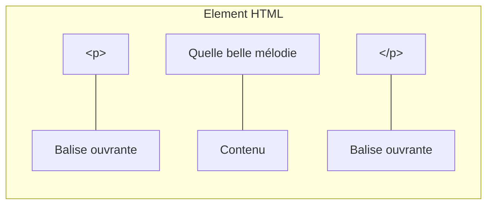
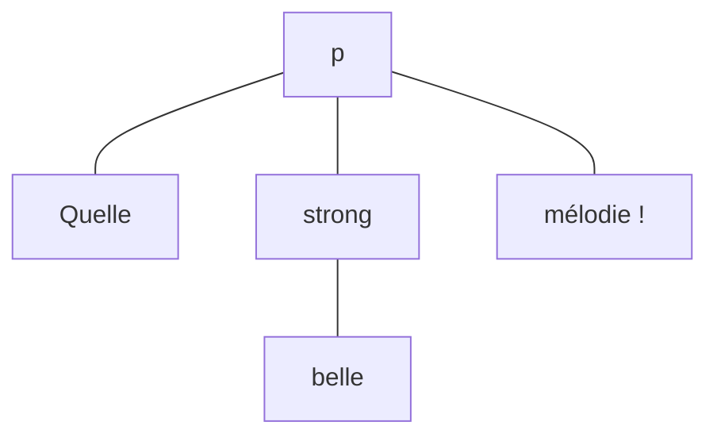
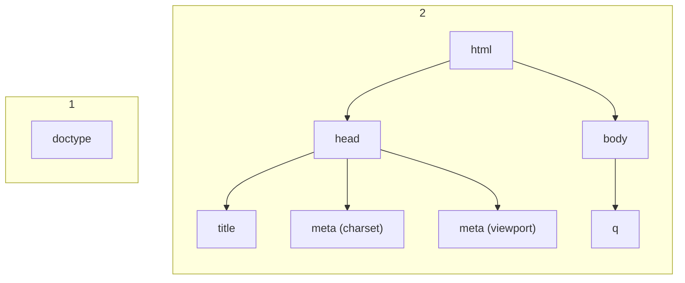

# Apprendre les Fondamentaux du Web avec un projet guidé de A à Z

## Notions de base en HTML

Le HTML est un langage de _balisage_ qui permet de définir la structure d'un contenu.

Un document HTML est ainsi une suite d'**éléments** utilisé pour encadrer le contenu afin de les faire apparaître ou les faire se comporter d'une certaine façon.

Exemple Si nous prenons le contenu:

```html
Quelle belle mélodie !
```

Si on veut que la ligne ait son propre paragraphe, on peut utiliser les **balises** qui correspondent: `<p>` pour encadrer le contenu:


```html
<p>Quelle belle mélodie !</p>
```

### Une balise ? Un élément ?
Oui, les balises sont utilisées pour donner de la **valeur** à un contenu, un **sens** en quelque sorte.

#### Structure d'un élément HTML

Reprenons le snippet de la section précédente.
```html
<p>Quelle belle mélodie !</p>
```

On peut identitfier trois parties dans ce bout de code.



Les éléments peuvent aussi parfois avoir des attributs comme ceci:


```html
<p class="note" id="com12">Quelle belle mélodie !</p>
```

Un attribut contient des informations supplémentaires à propos de l'élement mais qui ne sont pas affichées. **class** c'est le nom de l'attribut et **note** correspond à sa valeur.

Certains attributs n'ont pas de valeur, comme **required** (Formulaires).

Suivez ces règles:

1. Les attributs sont séparés par des espaces.
1. La valeur est entre les guillemets doubles (`'`) ou simples (`'`)

#### Imbrication des éléments

Il s'agit du fait de placer un élément à l'intérieur d'un autre.

Par exemble pour accentuer sur le mot **belle** du paragraphe précédent, on peut faire comme suit:


```html
<p>Quelle <strong>belle</strong> mélodie !</p>
```

Ce pendant, il faut observer la règle que le premier élément ouvert sera le dernier à être fermé. (LIFO)

Utilisez ce diagramme pour comprendre:



#### Eléments vides
Il existe aussi des éléments vides.
Par exemple pour insérer une image, la balise c'est `img`

```html

```

### Anatomie d'un document HTML

Cette théorie qu'on vient de voir, s'appliquera à l'ensemble des éléments HTML. Cependant, sur page Web, on n'aura pas qu'un seul élément HTML. C'est pourquoi, il est important d'voir à quoi ressemble la structure d'une page Web.

Analysons le code suivant:
```html
<!doctype html>
<html>
    <head>
        <title>Une page Web</title>
        <meta charset="UTF-8">
        <meta name="viewport" content="width=device-width, initial-scale=1.0">
    </head>

    <body>
        
    </body>
</html>
```

On y trouve ce qui suit:



## La suite ?
Maintenant qu'on a la base, approfondissons la notion de balises.

Avec le langage HTML, on peut donner différentes valeurs à du texte. Commençons par le début, les **titres**.

* Les éléments **titre**
    Permettent d'indiquer qui sont les titres ou les sous-titres au sein de la page. Pour ce faire, on utilise les éléments `<h1>` - `<h6>`.

    *h1* a plus de valeur que *h6*.

    Si on prend exemple sur ce chapitre du cours jusqu'à ce niveau, on aura:

    ```html
    <h1>Apprendre les Fondamentaux du Web avec un projet guidé de A à Z</h1>
    <h2>Notions de base en HTML</h2>
    <h3>Une balise ? Un élément ?</h3>
    <h4>Structure d'un élément HTML</h4>
    ```

    > N'utilisez pas les niveaux de titres pour la mise en forme. Vraiment !

* Les paragraphes
    Le texte dans un document HTML doit être wrappé dans un paragraphe. Il sert à baliser du texte qui se trouve sur la page Web.

    ```html
    <p>Voici un paragraphe simple</p>
    ```

* Les listes 
    On peut rencontrer dans le contenu d'une page Web des liste. Le langage HTML a des éléments dédiés pour décrire les listes, ordonéées ou non.

    * Listes ordonnées (ordered list: `ol`)
    * Listes non ordonnées (unordered list: `ul`)
    * Chaque élément de liste est un *list item (`li`)*

    Exemple:
    ```html
        <p>En HTML, il existe deux sortes de listes:
        <ul>
            <li>Listes ordonnées</li>
            <li>Listes non ordonnées</li>
        </ul>
    ```

* Liens
    Les liens sont une partie essentielle du Web. Pour ajouter un lien en HTML on utilise l'élément `<a>`.
    
    ```html
        <p>Visitez mon <a href="https://facebook.com/moustaphaotf">profile Facebook</a>.</p>
    ```

## Exercice pratique

Afin d'appliquer l'ensemble de ces connaissances, nous donnons une page web que l'on va reproduire entièrement.

Faites un petit CV de vous pour vous présenter à un recruteur.
