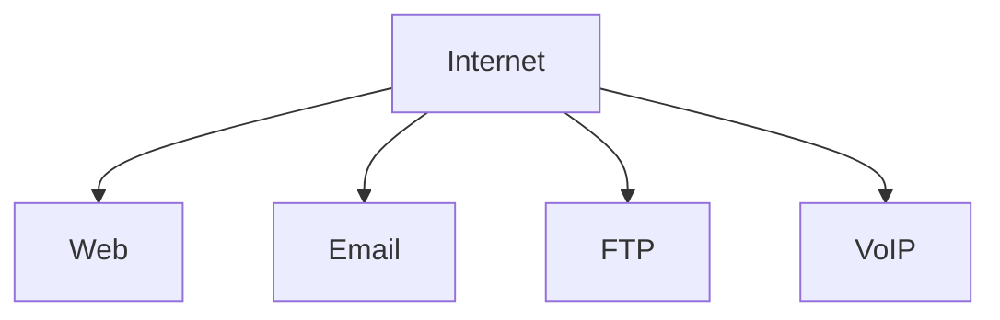
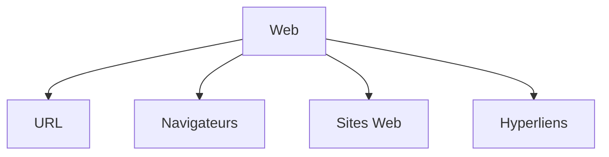
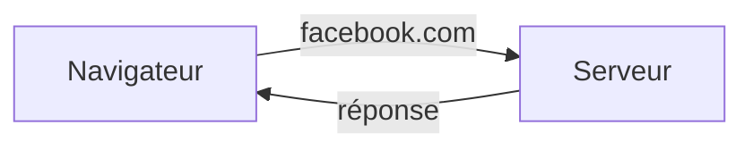
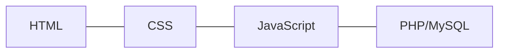
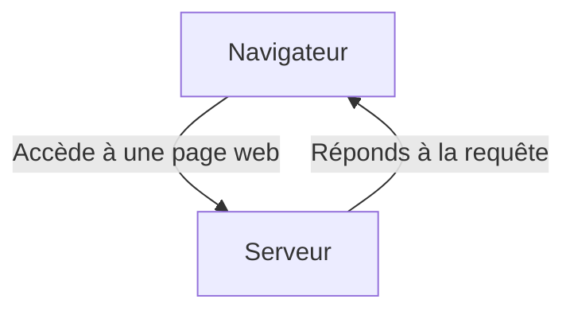

# Apprendre les Fondamentaux du Web avec un projet guidé de A à Z

# 1. Le Web ou Internet ?

Ehhh oui ! Deux concepts distincts !

> **Web :** C’est une collection de pages et de documents reliés par des hyperliens, accessible via des navigateurs. (Créé par **Tim Berners-Lee** - *1989*)

> **Internet :** Un gigantesque réseau d’ordinateurs interconnectés à l’échelle mondiale. (Précurseurs: **DARPA** - *1960*)

Pour dire vrai, **Internet** est un monde complexe. Constitué de plusieurs services.

Quand au **Web**, il a aussi ses composantes dont l'intérêt n'est pas moins important. Au contraire, chacune d'elle représente une brique à l'édifice:

Explorons plus en détails chaque composante.

**URL (Uniform Resource Locators) :** Permet d'accéder aux contenu sur le web. On peut dire qu'une URL représente un coordonnée d'une ressource en ligne.

Exemples: 
* `https://www.bing.com/search?q=le+web`
* `https://www.google.com/search?q=hello`
* `https://facebook.com/moustaphaotf`
* `https://en.wikipedia.org/wiki/List_of_presidents_of_Guinea#/media/File:Ahmed_S%C3%A9kou_Tour%C3%A9_(1982).jpg`

**Navigateurs**

Alors, les navigateurs sont le **portail vers le monde numérique**, ils permettent de traduire les code complexes en interface graphique accessible à l'utilisateur pour effectuer ses besoins.

Ces informations proviennent des serveurs accessibles grâce aux... bingo, ce sont bien les fameuses _URLs_.

Exemples:
* Google Chrome
* Mozilla Firefox
* Safari
* etc.

**Sites Web**
Il s'agit d'une collection organisée de pages Web qui fonctionnent de façon synchrone (hiérarchique des fois).

Ces pages sont ~~stockées~~ hébergées sur des serveurs pour être **accessibles 24/7** partout.

**Hyperliens**

Cela vous est déjà arrivé de jongler entre plusieurs pages Web.

Ce n'est rien de plus que la magie qui nous offerte par les hyperliens. Sur les pages web, ils sont facilement remarquables à cause de leurs style commun.

# 2. Le dynamisme
Le Web est un système en constante évolution. Il se nourrit à chaque instant permettant de relier le monde plus efficacement.

Tout cela est possible grâce au trio formé des langages du Web: HTML, CSS et JavaScript.

> **HTML(HyperText Markup Language):** permet de construire le squelette de toute page web. le contenu est organisé en section, paragraphes, listes, etc.

> **CSS (Cascading Style Sheets):** couplé au HTML, le CSS permet d'apporte la touche d'estétique en définissant la représentation visuelle: couleur, taille, typographie, etc.

> **JS (JavaScript):** Permet d'intégrer l'intéractivité sur la page web en répondant aux évènements qui surviennent lors de la navigation de l'utilisateur sur la page.

Dans cette formation, nous allons aborder beaucoup plus les deux premiers languages.

## Communication Client / Serveur

La réponse du serveur contient les codes et les ressources qui seront interprétés par le navigateur pour s'afficher à l'écran.

# 3. Le projet

Lors de ce cours, nous réaliserons ce projet-ci :

