# Les fondamentaux du Web
## Ressources
|Description|Lien|
|-|-|
|Powerpoint Web|https://github.com/moustaphaotf/web-fondamentals/blob/main/assets/Web.pdf|
|Code Source Projet|https://github.com/moustaphaotf/ISTDiplome|

## Le Web ou Internet ?

Ehhh oui ! Deux concepts distincts !

> **Web :** C’est une collection de pages et de documents reliés par des hyperliens, accessible via des navigateurs. (Créé par **Tim Berners-Lee** - *1989*)

> **Internet :** Un gigantesque réseau d’ordinateurs interconnectés à l’échelle mondiale. (Précurseurs: **DARPA** - *1960*)

Pour dire vrai, **Internet** est un monde complexe. Constitué de plusieurs services.

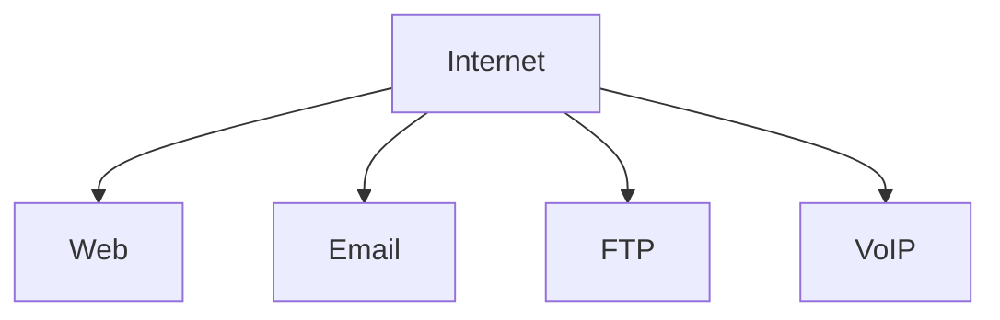

Quand au **Web**, il a aussi ses composantes dont l'intérêt n'est pas moins important. Au contraire, chacune d'elle représente une brique à l'édifice:

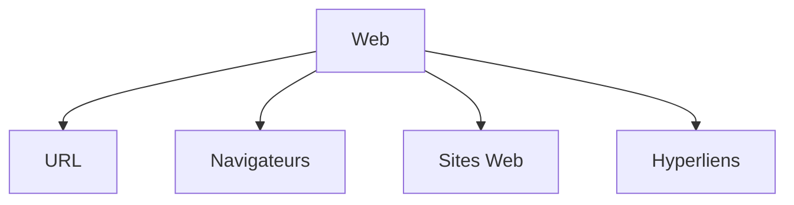

Explorons plus en détails chaque composante.

**URL (Uniform Resource Locators)**

Permet d'accéder aux contenu sur le web. On peut dire qu'une URL représente un coordonnée d'une ressource en ligne.

Exemples: 
* `https://www.bing.com/search?q=le+web`
* `https://www.google.com/search?q=hello`
* `https://facebook.com/moustaphaotf`
* `https://en.wikipedia.org/wiki/List_of_presidents_of_Guinea#/media/File:Ahmed_S%C3%A9kou_Tour%C3%A9_(1982).jpg`


**Navigateurs**

Alors, les navigateurs sont le **portail vers le monde numérique**, ils permettent de traduire les code complexes en interface graphique accessible à l'utilisateur pour effectuer ses besoins.


Ces informations proviennent des serveurs accessibles grâce aux... bingo, ce sont bien les fameuses _URLs_.

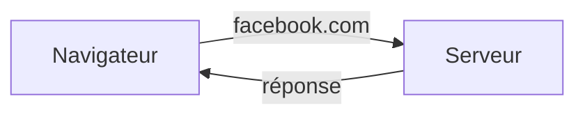

Exemples:
* Google Chrome
* Mozilla Firefox
* Safari
* etc.

**Sites Web**

Il s'agit d'une collection organisée de pages Web qui fonctionnent de façon synchrone (hiérarchique des fois).

Ces pages sont ~~stockées~~ hébergées sur des serveurs pour être **accessibles 24/7** partout.


**Hyperliens**

Cela vous est déjà arrivé de jongler entre plusieurs pages Web.

Ce n'est rien de plus que la magie qui nous offerte par les hyperliens. Sur les pages web, ils sont facilement remarquables à cause de leurs style commun.

## Le dynamisme

Le Web est un système en constante évolution. Il se nourrit à chaque instant permettant de relier le monde plus efficacement.

Tout cela est possible grâce au trio formé des langages du Web: HTML, CSS et JavaScript.

> **HTML(HyperText Markup Language):** permet de construire le squelette de toute page web. le contenu est organisé en section, paragraphes, listes, etc.

> **CSS (Cascading Style Sheets):** couplé au HTML, le CSS permet d'apporte la touche d'estétique en définissant la représentation visuelle: couleur, taille, typographie, etc.

> **JS (JavaScript):** Permet d'intégrer l'intéractivité sur la page web en répondant aux évènements qui surviennent lors de la navigation de l'utilisateur sur la page.

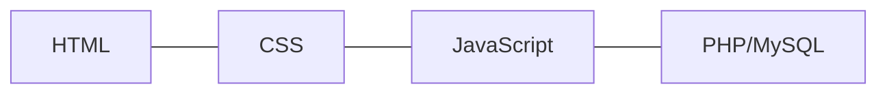

Dans cette formation, nous allons aborder beaucoup plus les deux premiers languages.

### Communication Client / Serveur


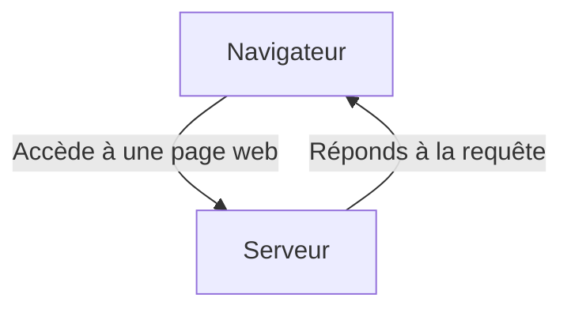

La réponse du serveur contient les codes et les ressources qui seront interprétés par le navigateur pour s'afficher à l'écran.

## Le projet de cours

Lors de ce cours, nous réaliserons ce projet-ci : https://moustaphaotf.github.io/web-fondamentals.

Il s'agit d'une application web permettant aux étudiants de télécharger leur diplômes d'étudiants à partir de leur matricule.

C'est un projet assez ludique aucours duquel on aura la chance de pratiquer le HTML, le CSS, le JavaScript, le SQL et le PHP.

---

# Notions de base en HTML

Le HTML est un langage de _balisage_ qui permet de définir la structure d'un contenu.

Un document HTML est ainsi une suite d'**éléments** utilisé pour encadrer le contenu afin de les faire apparaître ou les faire se comporter d'une certaine façon.

Exemple Si nous prenons le contenu:

```html
Quelle belle mélodie !
```

Si on veut que la ligne ait son propre paragraphe, on peut utiliser les **balises** qui correspondent: `<p>` pour encadrer le contenu:


```html
<p>Quelle belle mélodie !</p>
```

## Une balise ? Un élément ?
Oui, les balises sont utilisées pour donner de la **valeur** à un contenu, un **sens** en quelque sorte.

### Structure d'un élément HTML

Reprenons le snippet de la section précédente.
```html
<p>Quelle belle mélodie !</p>
```

On peut identitfier trois parties dans ce bout de code.

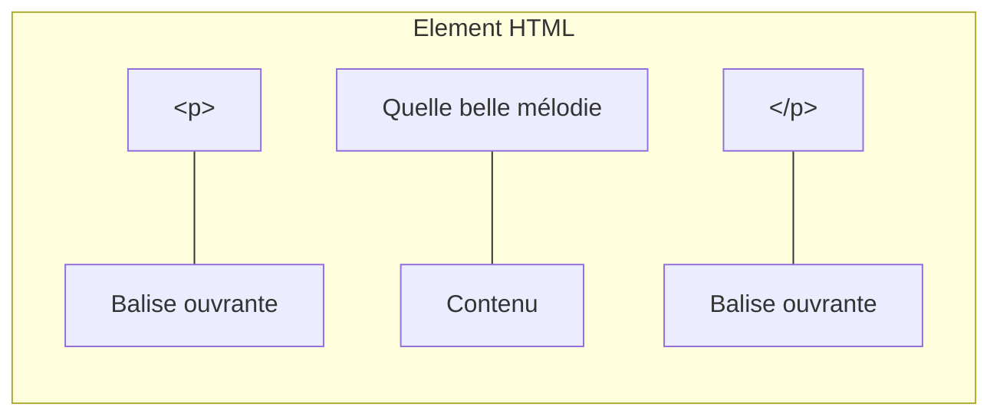

Les éléments peuvent aussi parfois avoir des attributs comme ceci:


```html
<p class="note" id="com12">Quelle belle mélodie !</p>
```

Un attribut contient des informations supplémentaires à propos de l'élement mais qui ne sont pas affichées. **class** c'est le nom de l'attribut et **note** correspond à sa valeur.

Certains attributs n'ont pas de valeur, comme **required** (Formulaires).

Suivez ces règles:

1. Les attributs sont séparés par des espaces.
1. La valeur est entre les guillemets doubles (`'`) ou simples (`'`)

### Imbrication des éléments

Il s'agit du fait de placer un élément à l'intérieur d'un autre.

Par exemble pour accentuer sur le mot **belle** du paragraphe précédent, on peut faire comme suit:


```html
<p>Quelle <strong>belle</strong> mélodie !</p>
```

Ce pendant, il faut observer la règle que le premier élément ouvert sera le dernier à être fermé. (LIFO)

Utilisez ce diagramme pour comprendre:

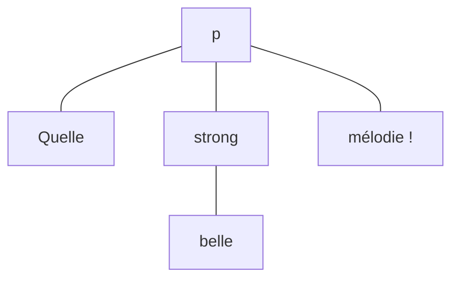

### Eléments vides
Il existe aussi des éléments vides.
Par exemple pour insérer une image, la balise c'est `img`

```html

```

## Anatomie d'un document HTML

Cette théorie qu'on vient de voir, s'appliquera à l'ensemble des éléments HTML. Cependant, sur page Web, on n'aura pas qu'un seul élément HTML. C'est pourquoi, il est important d'voir à quoi ressemble la structure d'une page Web.

Analysons le code suivant:
```html
<!doctype html>
<html>
    <head>
        <title>Une page Web</title>
        <meta charset="UTF-8">
        <meta name="viewport" content="width=device-width, initial-scale=1.0">
    </head>

    <body>
        
    </body>
</html>
```

On y trouve ce qui suit:

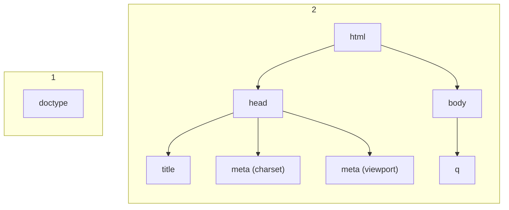

## La suite ?
Maintenant qu'on a la base, approfondissons la notion de balises.

Avec le langage HTML, on peut donner différentes valeurs à du texte. Commençons par le début, les **titres**.

* Les éléments **titre**
    Permettent d'indiquer qui sont les titres ou les sous-titres au sein de la page. Pour ce faire, on utilise les éléments `<h1>` - `<h6>`.

    *h1* a plus de valeur que *h6*.

    Si on prend exemple sur ce chapitre du cours jusqu'à ce niveau, on aura:

    ```html
    <h1>Apprendre les Fondamentaux du Web avec un projet guidé de A à Z</h1>
    <h2>Notions de base en HTML</h2>
    <h3>Une balise ? Un élément ?</h3>
    <h4>Structure d'un élément HTML</h4>
    ```

    > N'utilisez pas les niveaux de titres pour la mise en forme. Vraiment !

* Les paragraphes
    Le texte dans un document HTML doit être wrappé dans un paragraphe. Il sert à baliser du texte qui se trouve sur la page Web.

    ```html
    <p>Voici un paragraphe simple</p>
    ```

* Les listes 
    On peut rencontrer dans le contenu d'une page Web des liste. Le langage HTML a des éléments dédiés pour décrire les listes, ordonéées ou non.

    * Listes ordonnées (ordered list: `ol`)
    * Listes non ordonnées (unordered list: `ul`)
    * Chaque élément de liste est un *list item (`li`)*

    Exemple:
    ```html
        <p>En HTML, il existe deux sortes de listes:
        <ul>
            <li>Listes ordonnées</li>
            <li>Listes non ordonnées</li>
        </ul>
    ```

* Liens
    Les liens sont une partie essentielle du Web. Pour ajouter un lien en HTML on utilise l'élément `<a>`.
    
    ```html
        <p>Visitez mon <a href="https://facebook.com/moustaphaotf">profile Facebook</a>.</p>
    ```

## Exercice pratique

Afin d'appliquer l'ensemble de ces connaissances, nous donnons une page web que l'on va reproduire entièrement.

Faites un petit CV de vous pour vous présenter à un recruteur.

---

# Le language CSS

Alors, c'est bien curieux ! Mais voilà, ils ont créé le langage **CSS**. Qui permet de créer des feuilles de styles qu'on peut appliquer à notre squelette HTML afin de lui donner vie, de la forme, et des couleurs.

Il s'agit du **World Wide Web Consortium** (W3C) qui a la responsabilité de tout ce qui est spécification Web.

Le langage CSS nous permet donc de donner des styles à notre contenu HTML.

Nous allons y aller petit à petit pour découvrir les propriétés de styles fondamentales. Mais avant, il est important de pouvoir:

* Lier deux fichiers HTML et CSS.
* Comprendre les sélecteurs.

## Liaison des fichiers
Dans notre HTML, on peut indiquer quels fichier de style s'appliquent à notre page.

Pour cela, on utilise la balise `link` placée dans l'élément `head` de la page.

```diff
    <!doctype>
    <html>
        <head>
            <title>Le langage CSS</title>
            <meta charset="utf-8">
            <meta name="viewport" content="width=device-width, initial-scale=1.0">
+           <link rel="stylesheet" href="styles.css" >
        </head>
        <body>
            <h1>Apprenons les styles en CSS</h1>
        </body>
    </html>
```

Enregistrons le contenu et puis finalement, dans le même dossier que notre fichier HTML, on crée un fichier `styles.css`.

## Notions de sélecteurs
Maintenant que nous pensons que les fichiers HTML et CSS sont reliés, vérifions en appliquant notre premier style.

Dans le fichier CSS, on ajoute ce bout de code:

```css
body {
    background-color: green;
}
```

Enregistrons le fichier CSS et puis on va ouvrir le fichier HTML dans le navigateur.

Si tout est bien fait, on devrait avoir une nouvelle couleur à l'arrière plan: le **vert**.

Voilà, on vient comme ça d'écrire notre premier code CSS.

> **Note :** Il est inutile d'ouvrir le fichier CSS dans le navigateur. Nous avons créé le fichier HTML et nous avons ajouté une ligne pour le relier au code CSS. Du coup, il va importer les styles qui sont dans le fichier CSS pour se les appliquer.

Expliquons brièvement le code qu'on a écrit tout de suite.

En CSS, on a les sélecteurs, les propriétés et les valeurs; c'est tout !

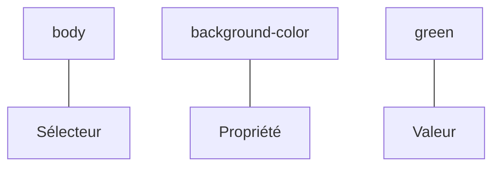

On va s'intéresser aux sélecteurs, il en existe plusieurs, mais on verra quelques uns seulement.

* Sélecteurs d'éléments comme `body`, `p`, `div`, `ul`, etc. On prend juste le nom de l'élement que l'on cible. Les propriétés seront appliqués à tous les éléments de la page qui sont de même type. Par exemple
    ```css
    p{
        color: red;
    }
    ```
    va colorier tous les paragraphes du document en rouge.

* Les sélecteurs de classe.

    En HTML, on peut créer des éléments en leur ajoutant un attribut `class`.
    ```html
        <body>
            <h1>Les sélécteurs</h1>
            <p class="highlight">Lorem ipsum</p>
            <p>Dolor sit</p>
            <p class="highlight">Amet consectetur</p>
        </body>
    ```

    Grâce à cet attribut, on pourra les cibler en CSS, comme suit:
    ```css
    .highlight {
        color: red;
        font-weight: 700;
    }
    ```

    Voilà !

    On peut même :
    ```css
    p.highlight {
        color: red;
        font-weight: 700;
    }
    ```
    pour dire qu'on ne s'intéresse qu'aux paragraphes qui ont la classe `highlight`

    &nbsp;

    > **Note:** Remarquez que la classe est collée au nom de l'élément.

    Si on veut styliser le paragraphe qui n'a pas la classe `highlight`, cibler juste avec `p` ne sera pas suffisant.

    Pour ce faire, on peut:
    
    ```css
    p:not(.highlight) {
        color: red;
        font-weight: 700;
    }
    ```

* Les sélecteurs d'identifiant !    
    Si on ajoute un attribut `id` à notre élément, alors on peut le cibler en CSS avec `#<nom-identifiant>`.

    Par exemple:

    ```html
    <body>
        <h1>Les sélécteurs</h1>
        <p>Dolor sit</p>
        <p id="second">Amet consectetur</p>
    </body>
    ```

    ```css
    #second {
        color: red;
        font-weight: 700;
    }
    ```

    > **Note :** Un identifiant est unique par page HTML.

Et ainsi de suite, il y en a plein d'autres sélecteurs comme :

* Sélecteur universel : 
    ```css
    /* Pour cibler tous les éléments de la page, quels qu'ils soient */
    * {
        margin: 0;
    }
    ```

* Sélecteur de descendants: 
    ```css
    /* Pour cibler toutes les cellules d'un tableau */
    table td {
        border: 1px solid black;
    }
    ```

* Sélecteurs d'enfants directs:

    ```css
    /* Pour cibler tous les paragraphes qui sont des enfants directs d'une div */
    div > p {
        text-align: center;
    }
    ```

* Sélecteurs de voisins
    ```css
    /* Pour cibler tous les paragraphes qui sont positionnés après des h2 */
    h2 + p {
        margin-top: 50px;
        border-top: 2px dashed gray;
    }
    ```

> **Note :** On peut grouper les sélecteurs en les séparant par une virgule.

## Valeurs spéciales
En CSS, il serait intéressant qu'on révise un peu quelques valeurs intéressantes:

* Les mesures
* Les couleurs

### Les mesures
Pour le cas des **mesures**, nous avons plusieurs unités telles que:
1. Les unités statiques
    - **pixel** (`px`)
    - **centimètre** (`cm`)
    - **inch** (`in`)
2. Les unités relatives
    - **pourcentage** (`%`)
    - **em** (relatif à la taille de police de l'élement parent.)
    - **rem** (relatif à la taille de police de l'élement `:root` ou `body`)
    - **vh** (relatif à hauteur du viewport)
    - **vw** (relatif à la largeur du viewport)

Cependant pour le cadre de ce cours, on se contentera de trois unités: `px`, `rem` et `em`.

### Les couleurs
Pour ce qui est des couleurs, il existe plusieurs façon de les exprimer également.

> Basiquement, on peut obtenir n'importe quelle couleur en additionnant des couleurs fondamentales : `rouge`, `bleu` et `vert`.

On va retenir trois façons pour donner une couleur (mais il en existe d'autres.)

* A partir de son nom
    Oui, des nom comme `blue`, `black`, `white`, `red`, `yellow`, `green`, `teal`, `purple`, `gray`, `turquoise`, `pink`, `violet`, etc. Une liste non exhaustive se trouve sur [cette page](https://www.w3schools.com/cssref/css_colors.php).
* A partir de son **code rgb**
    Pour le code **RGB**, il suffit de connaitre les variation de `rouge`, `bleu` et `vert` de la couleur pour obtenir la couleur que l'on veut. La quantité minimale pour chaque variation est **0** tandis que la quantité maximale est **255**.

    On va prendre quelques exemples

    |Couleur|Code RGB|
    |-|-|
    |Noir|`rgb(0, 0, 0)`|
    |Blanc|`rgb(255, 255, 255)`|
    |Bleu|`rgb(0, 0, 255)`|
    |Rouge|`rgb(255, 0, 0)`|
    |Vert|`rgb(0, 255, 0)`|
    |Jaune|`rgb(255, 255, 0)`|

* A partir de son **code hexadécimal**
    Finalement, il suffit de prendre la correspondance hexadécimale de chaque quantité du code **RGB** pour former une couleur en mode hexa. On va reprendre le tableau précédent.

    |Couleur|Code Hexa|
    |-|-|
    |Noir|`#000000`|
    |Blanc|`#FFFFFF`|
    |Bleu|`#0000FF`|
    |Rouge|`#FF0000`|
    |Vert|`#00FF00`|
    |Jaune|`#FFFF00`|

    
    > Note: Pour les valeurs **hexa**, naturellement, la quantité minimale est **00** tandis que la quantité maximale est **FF**.


## Texte mielleux
Après cet apparté sur les sélecteurs, les valeurs particulières, nous allons nous intéresser à comment on va enrichir notre texte. Pour cela, nous aborderons nombre de propriétés ayant trait au texte.

|Propriété|Description|
|-|-|
|`font-family`|Pour changer la police d'écriture|
|`font-weight`|Pour mettre le poids de la police (gras)|
|`font-size`|Modifier la taille de police|
|`text-align`|Changer l'allignement du texte|
|`text-decoration`|Pour la décoration du texte (soulignement)|
|`text-transform`|Changer la casse (majuscule, minuscule)|
|`color`|Pourla couleur de texte|
## Système de boites
En HTML, tout est une boite. Mais on classe les éléments en deux: **inline** et **block**.

> **Inline:** Ceux qui s'insèrent au flux et ne cause pas de décalage en occupant toute la largeur de l'écran.

> **Block:** Ceux qui s'insèrent au flux et causent un décalage en occupant toute la largeur qu'on leur attribue.

Et y a certaines propriétés assez intéressantes pour les boîtes:

* Les bordures (`border`)
* Les marges internes (`padding`)
* Les marges externes (`margin`)

## Et c'est bouclé !
Il y a assez de styles à explorer à découvrir. Mais, une fois à ce stade, on va attaquer le code de base de notre projet de formation.

---

# Notions de base en MySQL

MYSQL  est l'un des SGBD (Système de Gestion de Base de Données Relationnelles) les plus populaires de nos jours.

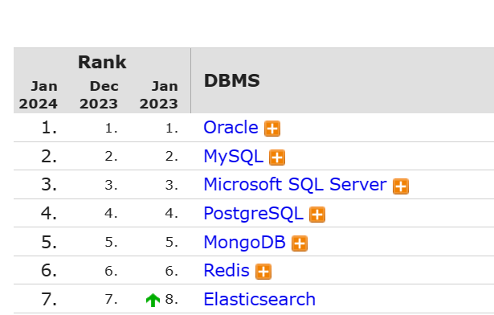

On utilise les SGBD pour gérer la base de données. Parmi les tâches nous avons la structuration des données grâce à un modèle. Aussi de contrôler les accès à la base de données, l'intégrité, la sécurité.

On appelle base de données un ensemble structuré d'informations relatives à un contenu.

Un SGBD peut gérer plusieurs bases de données en même temps.

Observez le graphique suivant.

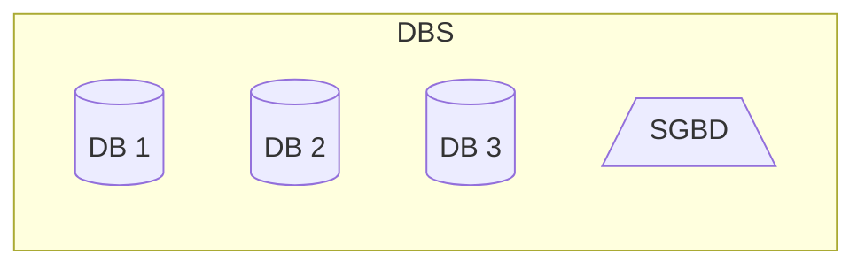

On parle de base de données relationnelles.

Observons ces tableaux suivants listant les auteurs et leurs oeuvres

* Auteurs
    |id|prenom|nom|
    |-|-|-|
    |1|Alexandre Biyidi|Awala|
    |2|Ousmane|Sembène|
    |3|Abdoulaye|Sadji|

* Oeuvres
    |id|titre|annee|auteur_id|
    |-|-|-|-|
    |1|Le Pauvre Christ de Bomba|1956|1|
    |2|Perpétue et l'habitude du malheur|1974|1|
    |3|Les bouts de bois de Dieu|1960|2|
    |4|Maïmouna|1953|3|
    |5|Nini, mulâtresse du Sénégal|1954|3|


Dans les bases données, les informations sont organisées en **tables** litteralement des tabeaux avec des lignes et des colonnes.

Les lignes sont appellées **enregistrements**.
Les colonnes sont appelées **champs** ou **attributs**.

Dans les deux tableaux *oeuvres* et *auteurs*, nous avons des informations bien établies. Mais en plus, on remarque des chiffres. Ces derniers nous permettent:

1. D'identifier chaque information de la base de données de façon unique : on parle de **clé primaire**.
2. D'établir la liaison des informations éparpiées dans plusieurs tables: on parle de **clé étrangère**.

---

## Outils

Pour pouvoir utiliser MySQL, nous avons dores et déjà installé [EasyPHP](https://www.easyphp.org/download.php), un outil simple parmi tant d'autres qui permet d'installer un serveur Web et un serveur de base de données ainsi que des outils d'administration.

Nous allons lancer le serveur et nous y connecter. Pour cela, nous allons modifier un peu les variables d'environnement système pour ajouter le chemin de l'exécutable `mysql`.

Sur la console, il suffit de se connecter à MySQL à travers la commande:

```bash
mysql -u root -p
```

Par défaut, il n'y a pas de mot de passe, il suffit d'appuyer sur la touche entrée.

Une fois connecté, nous allons désormais faire des requêtes.

> Une requête est une instruction ou une demande lancée au serveur en vue d'obtenir une réponse.

* Lister les bases de données
    ```sql
    SHOW DATABASES;
    ```

* Créer une base de données
    ```sql
    CREATE DATABASE library CHARACTER SET UTF8MB4;
    ```

* Sélectionner une base données
    ```sql
    USE library;
    ```

* Lister les tables à l'intérieur
    ```sql
    SHOW TABLES;
    ```

Intéressons-nous à ce modèle E/R pour la bibliothème où on va supposer qu'un bouquin a un auteur et un même auteur peut publier plusieurs oeuvres.

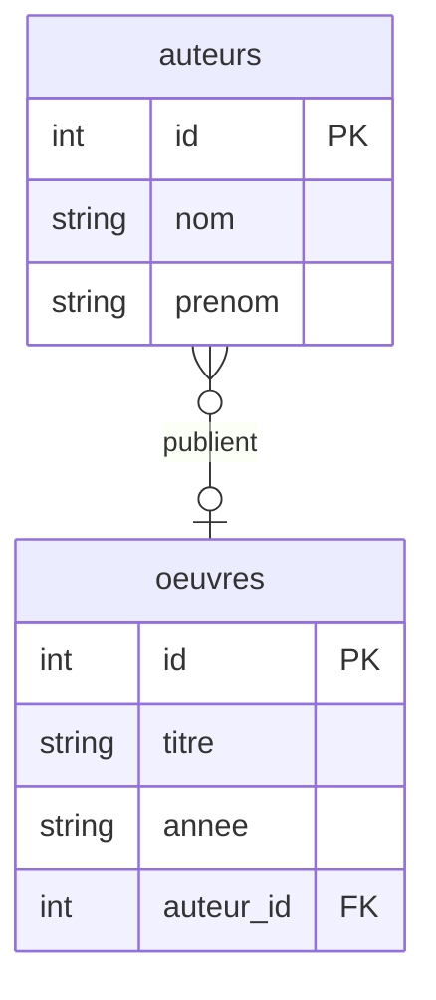

Comme on a appris, en modèle logique, pour pouvoir garder trace de celui qui a publié l'oeuvre, la clé de l'auteur va intégrer la table oeuvres.

Bon, pour finir on va mettre les scripts pour créer ces deux tables et les associer par une relation.

* Créer la table `oeuvres`
    ```sql
    CREATE TABLE oeuvres(
        id INT AUTO_INCREMENT PRIMARY KEY,
        titre VARCHAR(100) NOT NULL,
        annee VARCHAR(4),
        auteur_id INT
    )engine=InnoDB;
    ```

* Créer la table `auteurs`
    ```sql
    CREATE TABLE auteurs(
        id INT AUTO_INCREMENT PRIMARY KEY,
        nom VARCHAR(20) NOT NULL,
        prenom VARCHAR(30) NOT NULL
    )engine=InnoDB;
    ```

* Relier les deux tables
    ```sql
    ALTER TABLE oeuvres
    ADD CONSTRAINT FOREIGN KEY(auteur_id)
    REFERENCES auteurs(id)
    ON DELETE SET NULL;
    ```


A ce stade, on peut vérifier nos changements:

```sql
SHOW TABLES;
DESCRIBE oeuvres;
DESC auteurs;

SHOW CREATE TABLE oeuvres;
SHOW CREATE TABLE auteurs;
```

Nous pouvons aussi le vérifier directement sur l'espace d'administration phpMyAdmin.

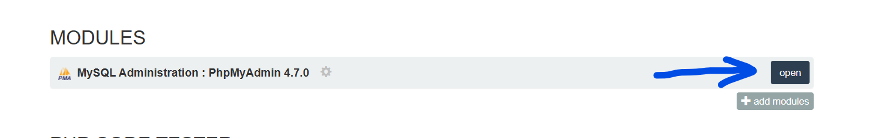

Nous allons explorer plus en détails ce qu'on peut faire.

## CRUD

Le CRUD est un acronyme signifiant `CREATE`, `READ`, `UPDATE`, `DELETE`. Le diagraphe mermaid suivant explique cela d'avantage.

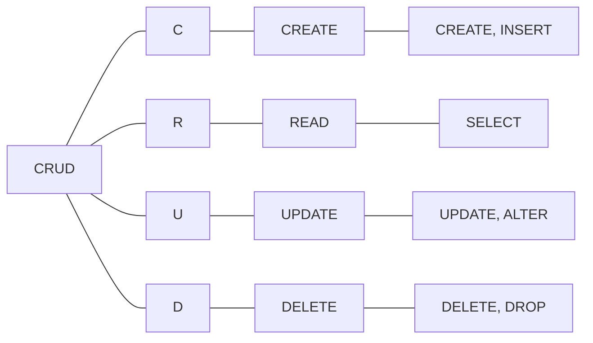

Nous allons donc nous amuser à twick avec la base de données qu'on a créée jusqu'ici.

* Ajouter des données dans les tables (CREATE):

    ```sql
    INSERT INTO auteurs (id, nom, prenom) 
    VALUES (1, "Alexandre Biyidi", "Awala");

    INSERT INTO auteurs (id, nom, prenom) 
    VALUES (2, "Ousmane", "Sembène");

    
    INSERT INTO auteurs (id, nom, prenom) 
    VALUES (3, "Abdoulaye", "Sadji");
    ```

    De cette façon nous avons nos trois auteurs...

* Vérifions l'ajout en listant les informations qui se trouvent sur la table (READ)

    ```sql
    SELECT * FROM auteurs;
    ```

* On peut aussi s'amuser à ajouter d'autres auteurs hein 😋😋😋 !

    ```sql
    INSERT INTO auteurs (nom, prenom) 
    VALUES 
    ("", ""),
    ("", ""),
    ("", ""),
    ("", "");
    ```

    > **Note:** Vous devez remplacez les chaines vides par les noms et prenoms ... 

    ça devient intéressant si en effet on peut ajouter plusieurs à la suite !


* Qui a dit qu'il n'y avait que les auteurs ? il ont écrit non ?

    ```sql
    INSERT INTO oeuvres (id, titre, annee, auteur_id)
    VALUES (1, "Le Pauvre Christ de Bomba", 1956,1);

    INSERT INTO oeuvres (id, titre, annee, auteur_id)
    VALUES (2, "Perpétue et l'habitude du malheur", 1974, 1);

    INSERT INTO oeuvres (id, titre, annee, auteur_id)
    VALUES (3, "Les bouts de bois de Dieu", 1960, 2);

    INSERT INTO oeuvres (id, titre, annee, auteur_id)
    VALUES (4, "Maïmouna", 1953, 3);

    INSERT INTO oeuvres (id, titre, annee, auteur_id)
    VALUES (5, "Nini, mulâtresse du Sénégal", 1954, 3);
    ```

    > Remarquez j'ai omi les guillemets autour de l'année. Oui, c'est possible si c'est un nombre on affecte à une chaine.


Bref, maintenant qu'on a des informations, on va faire des requests assez interessantes !

* Afficher les livres
    ```sql
    SELECT * FROM oeuvres;
    ```

* Mais on peut aussi ajouter des livres non ???
    ```sql
    INSERT INTO oeuvres (titre, annee, auteur_id) 
    VALUES 
    ("", "", NULL),
    ("", "", NULL),
    ("", "", NULL),
    ("", "", NULL),
    ("", "", NULL),
    ("", "", NULL);
    ```

    > **Note:** Remplacez les valeur par les bonnes !

On va maintenant voir comment répondre aux questions suivantes:

* Les livres de Aboudlaye Sadji

    Si on regarde dans la table auteur, `Abdoulaye Sadji` a pour `id` la valeur `3`. Alors, on peut faire:

    ```sql
    SELECT * FROM oeuvres
    WHERE auteur_id = 3;
    ```

    > La clause `WHERE` permet de filtrer les données.

* Les livres qui n'ont pas d'auteurs

    Si vous avez ajouté des livres sans leur affecter son `auteur_id` (`NULL` par défaut), on dira qu'il n'ont pas d'auteurs.

    ```sql
    SELECT * FROM oeuvres
    WHERE auteur_id IS NULL;
    ```

* Les livres qui sont publiés après 1960

    ```sql
    SELECT * FROM oeuvres
    WHERE annee > 1960;
    -- On peut aussi mettre 1960 entre guillemets.
    ```

* Les livres qui sont publiés en 1960

    ```sql
    SELECT * FROM oeuvres
    WHERE annee = 1960;
    ```

* L'auteur de ce livre

    Le livre publié en `1960` est d'`Ousmane Sembène` (`id = 2` )

    ```sql
    SELECT * FROM auteurs
    WHERE id = 2;
    ```

* Les auteurs qui ont des bouquins dans la DB

    Oui ! Il y a des auteurs dont on a pas encores enregistré des oeuvres.

    ```sql
    SELECT * FROM auteurs
    WHERE id IN (
        SELECT DISTINCT auteur_id FROM oeuvres 
        WHERE auteur_id IS NOT NULL
    );
    ```

* Les auteurs qui n'ont pas de bouquins dans la DB

    Il s'agit du contraire de la question précédente !

    ```sql
    SELECT * FROM auteurs
    WHERE id NOT IN (
        SELECT DISTINCT auteur_id FROM oeuvres 
        WHERE auteur_id IS NOT NULL
    );
    ```

* Le plus vieux bouquin enregistré

    Ce bouquin a l'année la plus petite !

    ```sql
    SELECT * FROM oeuvres
    WHERE annee = (
        SELECT MIN(annee) FROM oeuvres
    );
    ```

* L'auteur du plus vieux bouquin enregistré

    Il suffira de noter l'`auteur_id` dans la question précédente !

    > Et dans la requête, on remplace `<auteur_id>` par cette valeur !

    ```sql
    SELECT * FROM auteurs
    WHERE auteur_id = <auteur_id>;
    ```

On peut vraiment utiliser les requêtes pour récupérer des informations plus complexes

* Le nombre de livres

    ```sql
    SELECT COUNT(id) AS nb_livres FROM oeuvres;
    ```
    
* Le nombres d'auteurs

    ```sql
    SELECT COUNT(id) AS nb_auteurs FROM auteurs;
    ```
* Le nombre de bouquins dans la DB pour chaque auteur

    Plus complexe, ici nous allons utiliser une jointure !

    ```sql
    SELECT auteurs.id, auteurs.nom, auteurs.prenom, COUNT(oeuvres.id) AS nb_oeuvre
    FROM oeuvres
    RIGHT JOIN auteurs
    ON oeuvres.auteur_id = auteurs.id
    GROUP BY auteurs.id, auteurs.nom, auteurs.prenom;
    ```

Fini les SELECT

On va update !
Delete !
Puis drop !

> Une fois à ce stade, on va s'interesser à notre projet pour créer sa base de données.

---

# Notions de base en PHP

PHP est un langage de programmation qui permet de créer des pages web dynamiques.

On dit que le langage est un langage orienté serveur backend. Parce que grâce à lui on génère des pages web qui peuvent être retournées au client HTTP.

De base, avec le dossier `ISTDiplome` qui contient des fichiers **HTML** et **CSS** et qui décrit l'architecture générale le notre application nous pouvons tout naturellement l'héberger sur un serveur local **Apache** qui permet de traduire les pages **PHP**. Mais vu que ce sont des fichiers HTML qu'on a, on dira que notre site pour l'instant est **statique**.

A travers ce didacticiel, nous allons explorer toutes les étapes qu'il faut pour bien réussir à rendre le projet **dynamique** en vue de télécharger le diplôme de n'importe qui qui se trouve dans la base de données.

Tout d'abord, nous avons donné une brève définition au langage PHP, on va y revenir encore:

> **PHP** est un langage de programmation orienté serveur qui permet de rendre des sites web dynamiques.

## Setup
Grâce à l'installation qu'on a faite de EasyPHP, nous avons installé non seulement un serveur de bases de données `MySQL`(qu'on avait exploré hier) mais aussi un serveur HTTP: `Apache` pouvant interpréter les codes PHP.


L'accès au dashboard nous permettrait de pouvoir configurer des virtual hosts mais vu que cela n'a pas marché pour la plupart, nous allons juste copier coller le dossier de notre projet `ISTDiplome` dans le dossier `eds-www` d'EasyPHP. Grâce à cela, nous pourrons y accéder simplement à travers l'une de ces addresses suivantes:

* http://localhost:8080/ISTDiplome
* http://127.0.0.1:8080/ISTDiplome
* http://localhost/ISTDiplome
* http://127.0.0.1:8080/ISTDiplome

> La page par défaut qui sera chargée est `index.html`.


Le premier setup qu'on va faire sera de changer l'extention de tous nos fichiers en `.php` en lieu et place de `.html`. En effet, un fichier PHP doit avoir l'extention `.php`.

> Vous ne pouvez plus cliquer directement sur le fichier `.php` pour le lancer. Cela ne marchera plus ! Plutôt il faut utiliser le serveur local pour accéder aux fichiers en fait !

> L'erreur à éviter aussi c'est d'effectuer des modifications sur une copie du projet autre que celle enregistrée dans le repertoire `eds-www`, cela ne marchera jamais !

---

## Découverte du PHP

Maintenant qu'on arrive à lancer le projet sur le navigateur, on va faire un aparté sur le PHP.

### Bloc PHP

En PHP, le code est enveloppé entre une balise ouvrante et une balise fermante !

```php
<?php 
    // Ici du code PHP
?>
```

> Tout ce qui se trouve en dehors du block sera rendu comme tel !
En effet, ça devient intéressant car on peut ainsi combiner du code HTML à du code PHP, pour dynamiser certaines parties du site web.
    

### Variables

En PHP, déclarer une variable est très simple, et en plus les types sont ceux que l'on retrouve en principe sur la majeur des langages de programmation !

```php
<?php
$age = 12; // Entier
$nom = "Moustapha"; // Chaine de caractères
$taille = 1.2; // Décimal
$amis = array("Mamadou", "Aliou", "Traoré");  // Tableau
?>
```

> Le nom d'une variable est précédée par dollar `$`.

### Afficher du contenu

En PHP, pour afficher du contenu, nous utilisons la commande (ou fonction) `echo`:

```php
<?php 
$nom = "Moustapha";
echo "Hello " . $nom;
?>
```

> **Note:** Nous avons utilisé l'opérateur `.` pour faire de la concaténation !


### Débogger avec `var_dump` !

La fonction `var_dump` est couramment utilisée pour faire du déboggage quand on code en PHP.

Il faut retenir que le déboggage sert lorsque l'on est en developpement !

Exemple :

```php
<?php
$amis = array("Mamadou", "Aliou", "Traoré");  // Tableau
var_dump($amis);
?>
```

### Premier script PHP

Nous allons écrire notre premier script PHP pour dire bonjour aux devs d'ici et d'ailleurs !

Créez un fichier `test.php` à la racine de votre dossier `ISTDiplome` et copier-coller le contenu ci-dessous !

```php
<!DOCTYPE html>
<html lang="fr">
<head>
    <meta charset="UTF-8">
    <meta name="viewport" content="width=device-width, initial-scale=1.0">
    <title>Document</title>
</head>
<body>
    <h1>Hello World !</h1>
    <p>Bonjour !</p>
</body>
</html>
```

> "**Mais qu'est-ce qui cloche avec ce code ?**"

Si vous aussi vous pensez que c'est juste du HTML, vous avez bien raison !

Si on charge ce fichier depuis `/ISTDiplome/test.php` sur le navigateur, eh bien on aurait le résultat ci-dessous :


### Dynamisme avec PHP

Alors **où est le PHP?** vous allez vous demander.

Tout d'abord, on vient de montrer la fonctionnalité de base de PHP !

Vous avez remarqué, nous n'avons aucune balise PHP dans le code précédent, donc c'est le contenu textuel qui sera rendu par le serveur; ce qui fait que nous avons une page HTML telle qu'on l'a rédigée !


Mais essayons avec ce code-ci:

```php
<?php 
$nom = "Moustapha";
?>

<!DOCTYPE html>
<html lang="fr">
<head>
    <meta charset="UTF-8">
    <meta name="viewport" content="width=device-width, initial-scale=1.0">
    <title>Document</title>
</head>
<body>
    <h1>Hello <?php echo $nom; ?> !</h1>
    <p>Bonjour !</p>
</body>
</html>
```

Vous remarquerez en chargeant la page `/ISTDiplome/test.php`, que cette fois-ci c'est plutôt `"Hello Moustapha !"` qui se trouve sur le titre `<h1>`!

Ici, le serveur a interprété le code PHP pour remplacer la variable par son contenu avant de retourner le résultat au navigateur.

### La superglobale `$_GET`

Nous pouvons pousser le dynamisme plus loin en récupérant le nom depuis l'URL:

Par exemple avec le code-ci-dessous:

```php
<?php 
$nom = "World";

if(isset($_GET['nom'])) {
    $nom = $_GET['nom'];
}
?>

<!DOCTYPE html>
<html lang="fr">
<head>
    <meta charset="UTF-8">
    <meta name="viewport" content="width=device-width, initial-scale=1.0">
    <title>Document</title>
</head>
<body>
    <h1>Hello <?php echo $nom; ?> !</h1>
    <p>Bonjour !</p>
</body>
</html>
```

Lorsque l'on accède à `/ISTDiplome/test.php`, rien ne va changer !

Mais lorsque l'on accède à `/ISTDiplome/test.php?nom=Moustapha`, cette fois-ce, la page rendue sera différente selon le paramètre `nom` (je lui ai affectée `'Moustapha'` mais je pouvais prendre autre nom aussi !)

C'est ce qu'on appelle  **requête paramétrée** !

> On a spécifié au serveur que lorsque le paramètre `nom` est fourni, c'est d'afficher `Hello` suivi du nom. Mais dans le cas contraire si le paramètre `nom` est omis, alors c'est d'afficher juste `Hello World`.

> Pour récupérer un paramètre se trouvant sur l'**URL** de la page, nous devons utiliser en **PHP** la **variable superglobale** `$_GET` qui contient tous les paramètres transmis par l'URL.


## Accès à une base de données

Savez-vous comment se passe la communication client-serveur ?


Ce qui n'est pas à négliger c'est que le serveur qui héberge nos scripts se charge de les interpréter avant de renvoyer le résultat de l'interprétation au client HTTP de départ !

Ce qui veut dire que notre navigateur n'est pas en mesure de voir le contenu du code PHP mais plutôt le résultat provenant de l'interprétation de ce code !

Alors pretons attention à ce qui suit:

1. Un client HTTP demande d'accéder à la page `/ISTDiplome/download.php?matricule=123`
2. Notre code PHP doit vérifier et récupérer la valeur du matricule.
3. Ensuite effectuer une requête à la base de données pour récupérer les informations portant sur le matricule en question
4. Si un résultat est trouvé, alors c'est bon, on peut lui renvoyer son diplôme contenant d'autres renseignements telles que le nom, le prenom, le matricule, le chef de département et le DG.


Si vous avez compris ce schéma de communication alors, ce code sera tout à fait lisible pour vous !

```php
<?php //    /ISTDiplome/download.php 

// Si le matricule n'est pas fourni, renvoyer vers 404 (NOT FOUND)
if(!isset($_GET['matricule'])) {
    header("Location: 404.php");
    exit();
}
$matricule = $_GET["matricule"];


// Paramètres permettant de se connecter au serveur de base de données
$hostname = "localhost";
$user = "root";
$password = "";
$dbname = "istdiplome";

$dns = "mysql:host=$hostname;dbname=$dbname";

// Tentative de connection à la base de données
// En cas d'erreur, rediriger vers 500.php (INTERNAL ERROR)
try {
    $db = new PDO($dns, $user, $password);

    // Lancer des requêtes à la base de données
    // ...
}
catch (PDOException $e) {
    header("Location: 500.php");
    exit();
}
?>
```

> Nous utilisons la construction `try...catch` qui permet d'intercepter toute erreur qui se produit dans le bloc `try` et de handle cette dernière dans le bloc `catch`. Cela permet d'éviter d'avoir des warnings sur la page web lorsque l'on sera en prod !

> Nous manipulerons par la suite l'objet `$db` pour envoyer des requêtes au serveur MySQL.

GDSC ISTM &copy; 2024